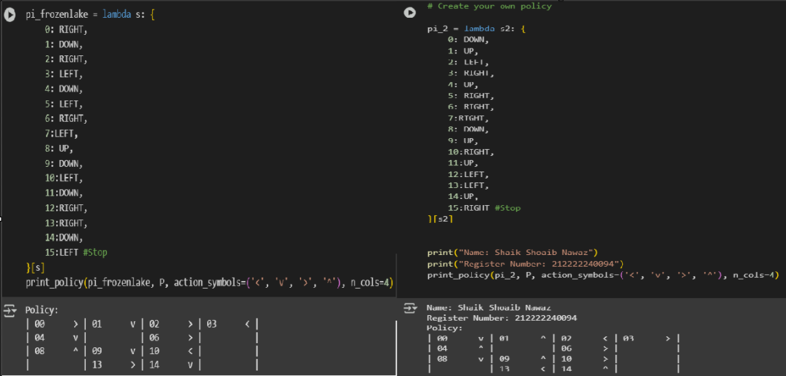
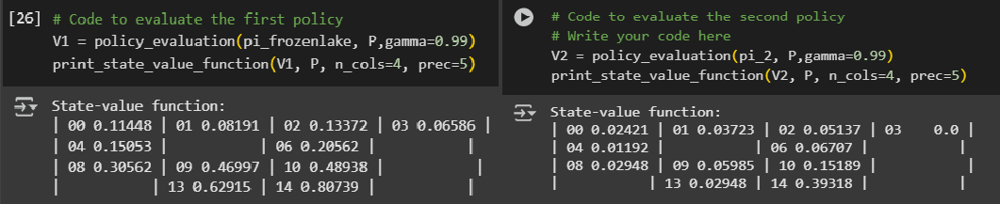
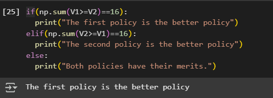

# POLICY EVALUATION

## AIM
To develop a Python program to evaluate the given policy.

## PROBLEM STATEMENT
To find best policy from two policies which are defined by user using policy evaluation function. Where the mdp includes 16 states from 0-15, 0 is the starting state, assigning some 4 random state as holes and 15 is the goal state and then we need to calculate optimal state value function for each state such that we can reach goal using optimal policy using policy evaluation.

## POLICY EVALUATION FUNCTION
```
def policy_evaluation(pi, P, gamma=1.0, theta=1e-10):
    prev_V = np.zeros(len(P), dtype=np.float64)
    # Write your code here to evaluate the given policy
    while True:
      V=np.zeros(len(P))
      for s in range(len(P)):
        for prob,next_state,reward,done in P[s][pi(s)]:
           V[s]+=prob*(reward+gamma *prev_V[next_state]*(not done))
      if np.max(np.abs(prev_V-V))<theta:
        break
      prev_V=V.copy()
    return V
```

## OUTPUT:

#### Policies:

#### State value function:

#### Best policy:


## RESULT:
Thus, The Python program to evaluate the given policy is successfully executed.

